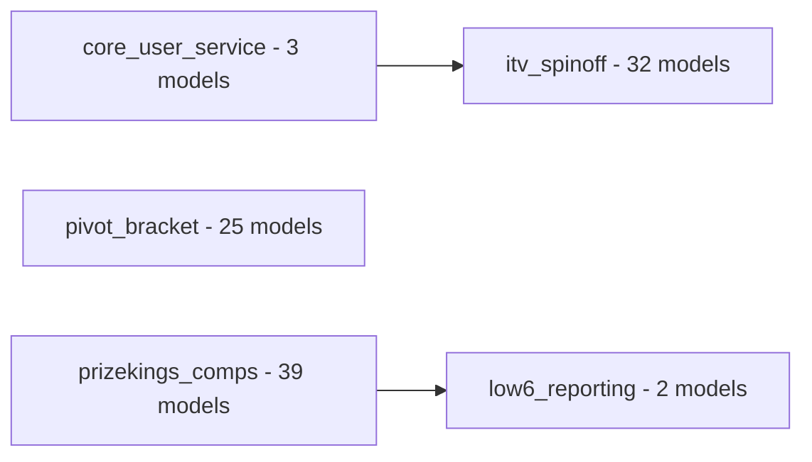

# low6_dbt_azureuksouth Data Project

## Overview

| Attribute | Value |
|-----------|-------|
| Database | BigQuery project `N/A` |
| Report tables | 0 (in `marts` schema) |
| Source systems | 0 () |
| Total models | 101 across 5 layers |

## Available Data

## Quick Reference

| Table | Grain | What it answers |
|-------|-------|-----------------|

## Architecture

## Navigation

### For querying data and building reports

### For contributing to the dbt project

- **core_user_service layer**: read [ref/core_user_service.md](ref/core_user_service.md)
- **itv_spinoff layer**: read [ref/itv_spinoff.md](ref/itv_spinoff.md)
- **low6_reporting layer**: read [ref/low6_reporting.md](ref/low6_reporting.md)
- **pivot_bracket layer**: read [ref/pivot_bracket.md](ref/pivot_bracket.md)
- **prizekings_comps layer**: read [ref/prizekings_comps.md](ref/prizekings_comps.md)
- **Source systems**: read [ref/sources.md](ref/sources.md)
- **SQL macros**: read [ref/macros.md](ref/macros.md)
- **Dependency graph**: read [ref/lineage.md](ref/lineage.md)

### Project variables

| Variable | Value |
|----------|-------|
| `prizekings_start_date` | `2026-02-11` |
| `local_timezone` | `Europe/London` |
